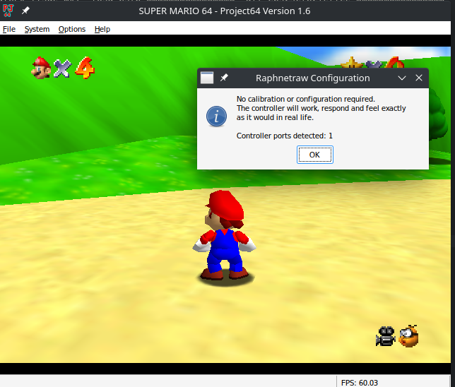
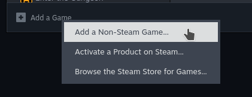
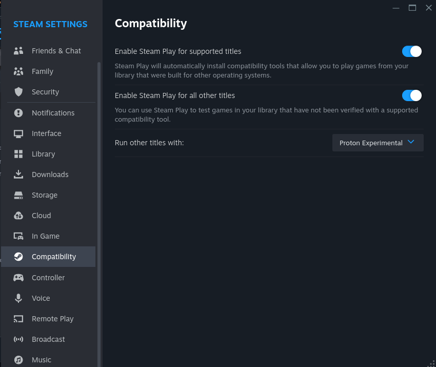
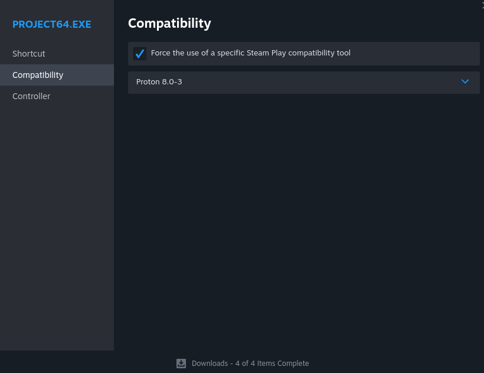

# Project64 1.6 on Linux/Wine documentation

This repository intends to document my process for setting up Project64 1.6 for use on Linux through Wine, specifically supporting the Raphnet adapter and the raphnetraw plugin.



# Obligatory Disclaimers

* I have not tested this on other machines
* It is written as a guide, but steps might be incomplete, or might not work on your machine, and will not walk you through the *entire* process (some assumptions are made)
    * Feel free to open an issue if you run into something, but I am not here to provide support, and I will adjust things as I am able to.
* The process will be different for macOS. How different I am not entirely sure.

To be totally honest, I am documenting this primarily for myself, but I figure it's good to share with others too. There are likely about 3 people in the entire world that care.

# Project64 Setup

The easiest way I found to run PJ64 was simply through Steam Play. Download a PJ64 1.6 package of your choice, and simply link Steam to the non-Steam game executable.



Of course, make sure Steam Play is enabled globally in the settings (enable steam play for all other titles): 



Enable Steam Play for your game (Proton 8.0-3 seems to work fine for me):




From here it should just work without further configuration.

# Setting up raphnetraw plugin

## Overview

Skip this if you just want to get it working and don't care. However, it's probably not going to work on the first try, so it's helpful to know what is going on.

For some reason, this part is unreasonably difficult. (Something had to make up for the fact that Project64 essentially "just works"..) For a brief overview of what is involved here, raphnetraw makes use of `hidapi`, a low-level API to HID devices. To my understanding, Wine/Steam Play expose controllers on higher-level APIs like XInput, or just through HID itself, but not in the way raphnetraw needs (raphnetraw makes use of feature reports to get the true raw data.)

[Wine *does* provide a method of exposing native HID devices](https://wiki.winehq.org/Hid) to Windows applications running in it, which would allow Windows hidapi to work in theory, but I am unable to get it working on my system. It can enumerate the HID devices, but it cannot open them properly (I suspect something is unimplemented within Wine's HID system.) I have scoured the internet for troubleshooting on this (`wine net start winebus`, registry fixes, etc.) and none of it has fixed it. Since it was a dead end, I decided to take a different approach.

Wine provides a mechanism for allowing Windows applications to interact with Linux libraries: `winelib`. You can compile a wrapper around the linux `hidapi` using `winelib`, and call the wrapped DLL around that. This ended up working, but it also necessitated some changes in the way that pj64raphnetraw invokes `hidapi`.  So, this guide walks you through compiling these custom versions of these tools.

## Binaries

I have provided my compiled library files in this repository (`bin/` directory). I have no idea if they will work on your system (they probably won't), but feel free to just skip to the [Installing](#installing) section and use these files instead. I am running Ubuntu 22.04. If they don't work, you'll have to compile them yourself as normal.

## Requirements

a very haphazard list of debian/ubuntu packages that you will need:

`sudo apt install -y wine wine32-tools libwine-dev:i386 libudev-dev:i386 libusb-dev:i386`

Of course, make sure you have i386 package support (dpkg-add-architecture)


## Compiling hidapi

Project64 under Proton seems to run a 32-bit Wine installation, so the library will need to be all 32-bit. This means you'll need to compile the Linux hidapi yourself. 

(in cloned hidapi directory)
```
./bootstrap
./configure --host=i386-pc-linux-gnu CFLAGS=-m32 CXXFLAGS=-m32 LDFLAGS=-m32
make
sudo make install
```
(you might have trouble with autoconf 2.71, i forgot what i did, i think i just installed autoconf 2.70 [make sure you install it not run it from the build directory])

You don't have to `make install` either, you can just leave it there - if you have an existing hidapi (64-bit) installation, you might consider leaving it there so this doesn't mess with it. But this makes it easier for the next steps when we need to link against it.

## Compiling hidapi_wineproxy+pj64raphnetraw

If you didn't do `make install` for `hidapi` earlier, modify line 13 of the Makefile in the `pj64raphnet_wine/src/` directory of this repo to include the directory where `hidapi.h` from earlier can be found. Similar for the Makefile in `pj64raphnet_wine/hidapi_wineproxy` - change lines 23 and 26 for the include and library directories containing the appropriate hidapi files, again if you have not already installed them to system directories.

Now, in theory, you just run `make` in the `pj64raphnetraw_wine` directory of this repo. The two dlls will be in the `out/` directory inside `pj64raphnetraw_wine`. If something breaks, you can either a) cry or b) just go back to Mupen.

## Installing 

Put `pj64raphnetraw.dll` in your Project64 Plugins folder like you would any other. Put `hidapi_wineproxy.dll` in the same folder as Project64.exe. Note that it ends in `dll` but it is actually by all means a Unix shared library, only usable with Wine. You will also need to put `libhidapi-hidraw.so` (all versions with the symlinks, so `libhidapi-hidraw.so`        `libhidapi-hidraw.so.0`, `libhidapi-hidraw.so.0.0.0`) in a directory that Wine searches in. This will depend on what version of Proton you selected for the game, but if you're running say 8.0, Steam stores its lib directory in:
`~/.steam/steam/steamapps/common/Proton\ 8.0/dist/lib/`. I found it easiest to just put the shared libraries here, but there is probably an environment variable you can just set to make it work for somewhere else.

Now you can just click launch on the game, and you should not get any warnings from raphnetraw saying it could not initalize the plugin, if everything is working fine. Head to `Options -> Configure Controller Plugin`` to check.

## Debugging

[DEBUGGING.md](debugging.md) contains a dump of some info about debugging or getting logs about what it happening if you do decide to troubleshoot this.


TODO: add shit about debugging